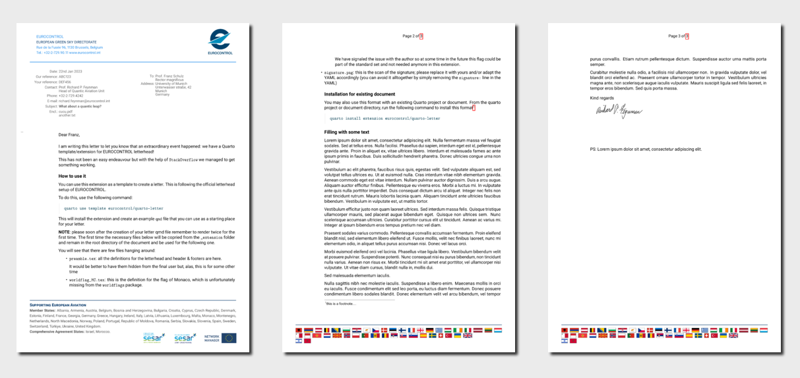

<!-- README.md is generated from README.qmd. Please edit that file -->

# EUROCONTROL Letter Format Template

This is a Quarto template that assists you in creating a letter on
EUROCONTROL letterhead

## Creating a new letter

You can use this as a template to create a letter. To do this, use the
following command:

``` bash
quarto use template eurocontrol/quarto-letter
```

This will install the extension and create an example qmd file that you
can use as a starting place for your letter.

**NOTE**: please soon after the creation of your letter remember to
render the qmd twice for the first time. This will copy the needed files

## Installation for existing document

You may also use this format with an existing Quarto project or
document. From the quarto project or document directory, run the
following command to install this format:

``` bash
quarto install extension eurocontrol/quarto-letter
```

## Example

<div>

[](examples/template.pdf)

</div>
